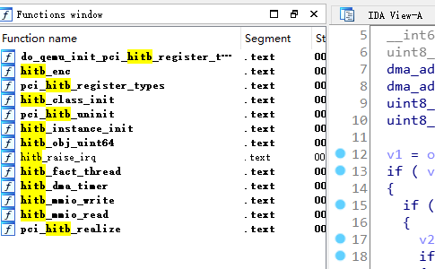

#  Hitb gesc 2017 babyqemu 

跟着大佬学:smiley:

平安夜莫得:apple:，只能敲代码度过。。。

参考链接:[ https://xz.aliyun.com/t/6694 ]( https://xz.aliyun.com/t/6694 )

[题目下载](https://github.com/ray-cp/vm-escape/tree/master/qemu-escape )

## 启动

运行的时候报错：

```shell
./qemu-system-x86_64: /usr/lib/x86_64-linux-gnu/libcurl.so.4: version `CURL_OPENSSL_3' not found (required by ./qemu-system-x86_64)
```

根据文章里敲入

```shell
sudo apt-get install libcurl3 
```

就可以跑起来了，虚拟机密码是root，密码是空

## 分析

这个qemu还是带符号的，根据启动脚本中的

```shell
#! /bin/sh
./qemu-system-x86_64 \
-initrd ./rootfs.cpio \
-kernel ./vmlinuz-4.8.0-52-generic \
-append 'console=ttyS0 root=/dev/ram oops=panic panic=1' \
-enable-kvm \
-monitor /dev/null \
-m 64M --nographic  -L ./dependency/usr/local/share/qemu \
-L pc-bios \
-device hitb,id=vda
```

`-device hitb`在ida中搜索`hitb`相关函数



 查看`pci_hitb_register_types`，再查看 `hitb_class_init`和`hitb_instance_init`，可以找到`HitbState` 结构体（反汇编代码的注释

结构体`HitbState`：

```c
00000000 HitbState       struc ; (sizeof=0x1BD0, align=0x10, copyof_1493)
00000000 pdev            PCIDevice_0 ?
000009F0 mmio            MemoryRegion_0 ?
00000AF0 thread          QemuThread_0 ?
00000AF8 thr_mutex       QemuMutex_0 ?
00000B20 thr_cond        QemuCond_0 ?
00000B50 stopping        db ?
00000B51                 db ? ; undefined
00000B52                 db ? ; undefined
00000B53                 db ? ; undefined
00000B54 addr4           dd ?
00000B58 fact            dd ?
00000B5C status          dd ?
00000B60 irq_status      dd ?
00000B64                 db ? ; undefined
00000B65                 db ? ; undefined
00000B66                 db ? ; undefined
00000B67                 db ? ; undefined
00000B68 dma             dma_state ?
00000B88 dma_timer       QEMUTimer_0 ?
00000BB8 dma_buf         db 4096 dup(?)
00001BB8 enc             dq ?                    ; offset
00001BC0 dma_mask        dq ?
00001BC8                 db ? ; undefined
00001BC9                 db ? ; undefined
00001BCA                 db ? ; undefined
00001BCB                 db ? ; undefined
00001BCC                 db ? ; undefined
00001BCD                 db ? ; undefined
00001BCE                 db ? ; undefined
00001BCF                 db ? ; undefined
00001BD0 HitbState       ends
```

和后面漏洞利用相关的`dma_state`结构体:

```c
00000000 dma_state       struc ; (sizeof=0x20, align=0x8, copyof_1491)
00000000                                         ; XREF: HitbState/r
00000000 src             dq ?
00000008 dst             dq ?
00000010 cnt             dq ?
00000018 cmd             dq ?
00000020 dma_state       ends
```

从 `hitb_class_init`函数 中可以看出：

```c
void __fastcall hitb_class_init(ObjectClass_0 *a1, void *data)
{
  PCIDeviceClass *v2; // rax

  v2 = (PCIDeviceClass *)object_class_dynamic_cast_assert(
                           a1,
                           "pci-device",
                           "/mnt/hgfs/eadom/workspcae/projects/hitbctf2017/babyqemu/qemu/hw/misc/hitb.c",
                           469,
                           "hitb_class_init");
  v2->revision = 0x10;
  v2->class_id = 0xFF;
  v2->realize = (void (*)(PCIDevice_0 *, Error_0 **))pci_hitb_realize;
  v2->exit = (PCIUnregisterFunc *)pci_hitb_uninit;
  v2->vendor_id = 0x1234;
  v2->device_id = 0x2333;
}
```

`vendor_id`和`device_id`,在配合lspci命令就能找到hitb这个device了

```
lspci
00:00.0 Class 0600: 8086:1237
00:01.3 Class 0680: 8086:7113
00:03.0 Class 0200: 8086:100e
00:01.1 Class 0101: 8086:7010
00:02.0 Class 0300: 1234:1111
00:01.0 Class 0601: 8086:7000
00:04.0 Class 00ff: 1234:2333	<--hitb
```

 `pci_hitb_realize`函数：

```c
void __fastcall pci_hitb_realize(HitbState *pdev, Error_0 **errp)
{
  pdev->pdev.config[0x3D] = 1;
  if ( !msi_init(&pdev->pdev, 0, 1u, 1, 0, errp) )
  {
    timer_init_tl(&pdev->dma_timer, main_loop_tlg.tl[1], 1000000, (QEMUTimerCB *)hitb_dma_timer, pdev);
    qemu_mutex_init(&pdev->thr_mutex);
    qemu_cond_init(&pdev->thr_cond);
    qemu_thread_create(&pdev->thread, "hitb", (void *(*)(void *))hitb_fact_thread, pdev, 0);
    memory_region_init_io(&pdev->mmio, &pdev->pdev.qdev.parent_obj, &hitb_mmio_ops, pdev, "hitb-mmio", 0x100000uLL);
    pci_register_bar(&pdev->pdev, 0, 0, &pdev->mmio);
  }
}
```

函数注册了一个timer,处理回调函数为`hitb_dma_timer`，也注册了`hitb_mmio_ops`内存操作的结构体，该结构体中包含`hitb_mmio_read`以及`hitb_mmio_write`，同时`size`大小为`0x100000` 

然后就是看最关键的三个函数`hitb_dma_timer`，`hitb_mmio_read`和`hitb_mmio_write`

### hitb_mmio_read

根据传入的addr返回`HitbState`中的一些变量

### hitb_mmio_write

```c
void __fastcall hitb_mmio_write(HitbState *opaque, hwaddr addr, uint64_t val, unsigned int size)
{
  uint32_t v4; // er13
  int v5; // edx
  bool v6; // zf
  int64_t v7; // rax

  if ( (addr > 0x7F || size == 4) && (!((size - 4) & 0xFFFFFFFB) || addr <= 0x7F) )
  {
    if ( addr == 0x80 )
    {
      if ( !(opaque->dma.cmd & 1) )
        opaque->dma.src = val;                  // set dma.src
    }
    else
    {
      v4 = val;
      if ( addr > 0x80 )
      {
        if ( addr == 0x8C )
        {
          if ( !(opaque->dma.cmd & 1) )
            *(dma_addr_t *)((char *)&opaque->dma.dst + 4) = val;
        }
        else if ( addr > 0x8C )
        {
          if ( addr == 0x90 )
          {
            if ( !(opaque->dma.cmd & 1) )
              opaque->dma.cnt = val;	//set dma.cnt
          }
          else if ( addr == 0x98 && val & 1 && !(opaque->dma.cmd & 1) )
          {
            opaque->dma.cmd = val;		//set dma.cmd 
            v7 = qemu_clock_get_ns(QEMU_CLOCK_VIRTUAL_0);
            timer_mod(
              &opaque->dma_timer,
              ((signed __int64)((unsigned __int128)(0x431BDE82D7B634DBLL * (signed __int128)v7) >> 64) >> 18)
            - (v7 >> 63)
            + 100);
          }
        }
        else if ( addr == 0x84 )
        {
          if ( !(opaque->dma.cmd & 1) )
            *(dma_addr_t *)((char *)&opaque->dma.src + 4) = val;
        }
        else if ( addr == 0x88 && !(opaque->dma.cmd & 1) )
        {
          opaque->dma.dst = val;	//set dma.dst
        }
      }
      else if ( addr == 32 )
      {
        if ( val & 0x80 )
          _InterlockedOr((volatile signed __int32 *)&opaque->status, 0x80u);
        else
          _InterlockedAnd((volatile signed __int32 *)&opaque->status, 0xFFFFFF7F);
      }
      else if ( addr > 0x20 )
      {
        if ( addr == 0x60 )
        {
          .................................
        }
        else if ( addr == 100 )
        {
          ........................................
        }
      }
      else if ( addr == 4 )
      {
        opaque->addr4 = ~(_DWORD)val;
      }
      else if ( addr == 8 && !(opaque->status & 1) )
      {
       ..............................
      }
    }
  }
}
```

函数根据addr的值来对`HitbState`结构体成员进行赋值

### hitb_dma_timer

```c
// call back
void __fastcall hitb_dma_timer(HitbState *opaque)
{
  dma_addr_t v1; // rax
  __int64 v2; // rdx
  uint8_t *v3; // rsi
  dma_addr_t v4; // rax
  dma_addr_t v5; // rdx
  uint8_t *v6; // rbp
  uint8_t *v7; // rbp

  v1 = opaque->dma.cmd;
  if ( v1 & 1 )
  {
    if ( v1 & 2 )
    {
      v2 = (unsigned int)(LODWORD(opaque->dma.src) - 0x40000);
      if ( v1 & 4 )
      {
        v7 = (uint8_t *)&opaque->dma_buf[v2];
        ((void (__fastcall *)(uint8_t *, _QWORD))opaque->enc)(v7, LODWORD(opaque->dma.cnt));
        v3 = v7;
      }
      else
      {
        v3 = (uint8_t *)&opaque->dma_buf[v2];
      }                                         // oob read
      cpu_physical_memory_rw(opaque->dma.dst, v3, opaque->dma.cnt, 1);// memcpy(dma.dst,v3,dma.cnt)
      v4 = opaque->dma.cmd;
      v5 = opaque->dma.cmd & 4;
    }
    else
    {                                          
      v6 = (uint8_t *)&opaque[0xFFFFFFDBLL].dma_buf[(unsigned int)opaque->dma.dst + 0x510];
      LODWORD(v3) = (_DWORD)opaque + opaque->dma.dst - 0x40000 + 0xBB8;// opaque+0xbb8 --> dma_buf
                                                // v6 = &dma_buf[dma.dst-0x40000]
      cpu_physical_memory_rw(opaque->dma.src, v6, opaque->dma.cnt, 0);// memcpy(v6,dma.src,dma.cnt)
      v4 = opaque->dma.cmd;
      v5 = opaque->dma.cmd & 4;
      if ( opaque->dma.cmd & 4 )
      {
        v3 = (uint8_t *)LODWORD(opaque->dma.cnt);
        ((void (__fastcall *)(uint8_t *, uint8_t *, dma_addr_t))opaque->enc)(v6, v3, v5);
        v4 = opaque->dma.cmd;
        v5 = opaque->dma.cmd & 4;
      }
    }
    opaque->dma.cmd = v4 & 0xFFFFFFFFFFFFFFFELL;
    if ( v5 )
    {
      opaque->irq_status |= 0x100u;
      hitb_raise_irq(opaque, (uint32_t)v3);
    }
  }
}
```

函数根据`dma.cmd`来进行相对应的操作

- 当`cmd`为 **1|0**的时候，把`dma.src`的内容拷贝到`&dma_buf[dma.dst-0x40000]`，拷贝长度为`dma.cnt`这里ida识别的好像有点问题，看相对应的汇编代码会更清晰一些
- 当`cmd`为 **1|2**的时候，把`dma_buf[dma.src - 0x40000]`的内容拷到`dma.dst`，拷贝长度为`dma.cnt`
- 当`cmd`为 **1|2|4** 的时候,就是在上一个操作的基础上加了一个加密

这里的拷贝函数用的是`cpu_physical_memory_rw` ，这个函数是使用物理地址作为源地址或目标地址，所以需要先申请一段内存空间，并将其转换至其物理地址，在当作参数 

漏洞点呢就是oob，`dma.src`,`dma.dst`,`dma.cmd`和`dma.cnt`我们都可以控制，而dma_buf的长度只有0x1000大，所以可以用`hitb_mmio_write`和`hitb_dma_timer`函数配合完成攻击，跟随大佬思路

**思路**：

- 先是越界读的内容，往`dma_buf`后面是`enc`函数指针，可以读取该指针的值以实现地址泄露。泄露地址后根据偏移，可以得到程序基址，然后计算得到`system plt`地址。

- 将参数`cat /root/flag`写入到`dma_buf`中。

- 其次是越界写的内容，可以将`system plt`地址写入到`enc`指针，最后触发`enc`函数实现`system`函数的调用，实现`system("cat /root/flag")`。

看懂了，（其实一点也没看懂


## 结果

最后看着大佬的exp一步一步调试，最终成功啦，感谢大佬详细的文章

```shell
# ./exp
mmio_mem addr: 0x7fd5946a0000
userbuf virtual addr: 0x7fd59469f000
userbuf physical addr: 0x3fdc000
leaking enc function:0x56518a944dd0
# flag{welcome_to_qemu_world}		;自己加的XD
```

开心:smile: